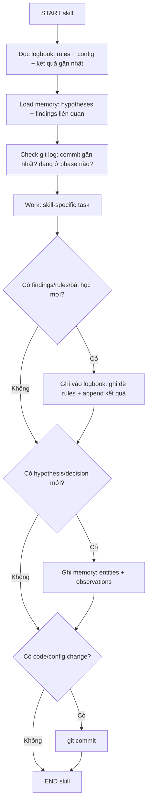

# LeWM Project — AGENT CONTEXT 

## ⚡ MASTER PROTOCOL — 3 pillars of truth + 3-step decision

**3 pillars of truth:** Mọi kết luận phải đủ Lý thuyết (Theory) + Paper/Data + Thực nghiệm (Empirical). Thiếu 1 → ghi "chưa biết, cần X".

**3-step decision:**
1. Test trước — đủ data ko? Mơ hồ ko? Thiếu → dừng, báo thiếu.
2. Chọn đường tối ưu bền vững — robust, maintain được, ko technical debt.
3. Mơ hồ = thiếu data → nói thẳng "cần X", ko suy diễn, ko bịa.

**Lý thuyết là quan trọng nhất** — đọc paper gốc, hiểu bản chất toán học trước khi code/kết luận. Nếu ko hiểu → hỏi, đừng giả vờ.

**Nguyên tắc so sánh:** Phải xét đầy đủ mọi phương diện (params, T, budget, task, seed). Thiếu 1 yếu tố = kết luận chưa chắc.

**🔥 Không suy luận số từ đồ thị/ảnh:** Figure/PNG ko đọc được text. Nếu cần số → hỏi user mô tả hoặc chỉ dùng bảng số. Nếu ko có bảng → ghi "ước lượng, ko chính xác". Sai lầm: Figure 18 LeWM — tao tự bịa epoch 0 = 0.04, thực tế ~0.2.

## ⚡ PREFLIGHT PROTOCOL — bắt buộc mọi session

Trước mọi code/design decision (tự động):

```
1. [ ] big-picture-checker
      - List tree cấp 1-2 → xác định thư mục đích
      - Phân loại file: code→v2_6/  results→results/  doc→docs/
      
2. [ ] master-verification
      - Claim có đủ 3 pillars? (Theory + Paper + Data)
      - Thiếu 1 → DỪNG, báo user "cần X"
      
3. [ ] cognitive-auditor (pre-mode)
      - JIT compile cost? (scan body có heavy ko?)
      - Gradient còn ko? (fitness có cliff ko?)
      - Side-effect: file sửa → file nào phụ thuộc?
      
4. [ ] research-debug-protocol (nếu bug lần 2)
      - Lần 1: fix thử
      - Lần 2: vẫn fail → tự động kích hoạt research flow
      - Lần 2 pass → ghi logbook + memory
      
ALL pass → execute
ANY fail  → DỪNG + báo user
```

## Project
- **V0 [done]:** Bionic hand 8-DOF real, grasp confirmed (data tự xây)
- **V1 [abandoned]:** Hybrid CfC+Attention TwoRoom — 78%
- **V2.1 [done]:** Mamba-2+Attention predictor (TwoRoom, Push-T eval 94.7%)
- **V2.5 [proposed]:** 4-DOF robot công nghiệp nhỏ, deploy lightweight model cho demo ISEF
- **V2.6 [active]:** Neuroevolution action only — structured genome (neuron+connection), coordinate CPPN, GA loop (tournament, crossover, subst/ins/del), no-reward fitness (steps_alive). Code done ✅ — render OK, cần tune energy + push GitHub
- **V2.7 [future]:** + Sensor evolution — sensor gene duplication, derived obs, gene duplication analog biology
- **V2.8 [future]:** + Body evolution — morphology genes, MJX XML build, morphological evolution
- **V3 [future]:** Overhead cam, 1 agent, 2 robot
- **V3.1 [future]:** Overhead + 2 ego, 2 agent, 2 robot
- **V3.2 [future]:** 2 ego, 2 agent, 2 robot

## V2.1 Config
- **6×{Self-Attn(AdaLN) → Mamba-2}**, T=4, heads=16, d_state=256, expand=4
- Attention:Mamba-2 ≈ 1.43:1 (787K:550K per block)
- Predictor 9.36M, total 16.6M
- Eval: budget=50, goal_offset=25 (mọi task)
- Seed: 3072 (train + eval)
- Epochs: 10, batch=128, lr=5e-5, bf16
- Mamba-2 (wheel sẵn), Mamba-3 giữ tham khảo

## Tools installed (local machine)

### Nhóm A — TOÁN & ĐO LƯỜNG (Theory + Analysis)
- **SymPy** (v1.14.0) — symbolic math: đạo hàm, tích phân, giải ODE, matrix. Derive analytical solutions.
- **pyitlib** — discrete information theory: entropy, MI, KL divergence. Estimators: ML, MAP, PERKS, MINIMAX, JAMES-STEIN, GOOD-TURING.
- **infomeasure** (v0.6.0) — info theory (cả discrete + continuous): entropy, MI, transfer entropy, KLD. Approach: nsb, ksg, metric, kernel, ordinal, renyi. Paper Nature 2025.

### Nhóm B — MÔ PHỎNG & THỬ NGHIỆM (Simulation)
- **MuJoCo** — physics engine 3D: robot simulation, contact dynamics, camera rendering. Python API: `mujoco`, `mujoco.viewer`, `mujoco.Renderer`.
- **Golly** (v4.3) — Cellular Automata 2D: Game of Life, rule tables, pattern emergence. API: `import golly as g`.
- **NetLogo** — agent-based model 2D: social systems, swarm, emergence. API: `pynetlogo.NetLogoLink()`. Tự download tại netlogo.org, bỏ vào D:\NetLogo.

### General
- **Python 3.14** + PyTorch, NumPy, SciPy (Colab).

## MASTER ARCHITECTURE — 3-tier system + mandatory flow

Mọi skill tuân theo architecture này. Đây là master protocol, ko override.

### The 3 tiers

| Tầng | Nơi lưu | Chứa | Ai chịu trách nhiệm sync |
|---|---|---|---|
| **LOGBOOK** | `plan/project_logbook.md` | Rules (CẦN NÉ), configs, bảng kết quả tổng hợp, bài học | `logbook-manager` |
| **MEMORY** | knowledge graph | Hypotheses, findings, entity relations, decisions | `memory_create_entities` / `memory_add_observations` |
| **GIT** | local repo | Full code/config history, diff trace, blame | `git commit` / `git log` |

### Mandatory flow — MỌI skill đều phải tuân



### Pre-check checklist (mở đầu mọi skill)
1. [ ] Đọc `project_logbook.md` — check rules + config current + kết quả gần nhất
2. [ ] `memory_read_graph` + `memory_search_nodes` query="keyword" — load findings liên quan
3. [ ] `git log --oneline -5` — biết commit cuối, phase hiện tại

### Post-check checklist (kết thúc mọi skill)
1. [ ] Nếu có findings/rules mới → `edit` logbook (ghi đè rules / append results)
2. [ ] Nếu có hypothesis/decision mới → `memory_create_entities` / `memory_add_observations`
3. [ ] Nếu có code/config change → `git add + git commit`

---

## Skill Contracts (inputs / outputs / dependencies)

Mỗi skill định nghĩa contracts trong YAML frontmatter của SKILL.md.
Orchestrator (`workflow-manager`) dùng contracts này để auto-chain.

| Skill | Inputs | Outputs | Depends pre | Depends post |
|---|---|---|---|---|
| `workflow-manager` | workflow_name, custom_steps | execution_log → logbook | — | logbook-manager |
| `agent-manager` | project_path | AGENTS.md project | — | — |
| `doc-reader` | tool_name | api_summary → caller | — | — |
| `paper-linker` | paper_title, url, findings | paper_links.md project | — | — |
| `research-paper-protocol` | paper_url | key_findings → caller, summary → link-paper/ | — | paper-linker |
| `theory-emergence-toolkit` | tools[], question | results → logbook, hypothesis → memory | doc-reader, RPP | master-verification |
| `code-discipline` | change_desc, target_file | commit_message → git | doc-reader | — |
| `master-verification` | claim | verdict → caller, evidence → memory | — | logbook-manager |
| `logbook-manager` | session_summary, rules, results | logbook_updated | master-verification | — |

## Workflow pipelines

`workflow-manager` cung cấp 3 templated pipelines (YAML):

| Pipeline | Steps | Gọi khi |
|---|---|---|
| `research-pipeline` | RPP → paper-linker → TET → master-verification → logbook-manager | Đọc paper + phân tích |
| `coding-pipeline` | doc-reader → code-discipline → master-verification → logbook-manager | Code/config change |
| `full-pipeline` | agent-manager → RPP → paper-linker → TET → doc-reader → code-discipline → master-verification → logbook-manager | Dự án mới / setup |

Ví dụ sử dụng:
```
# Research pipeline: đọc paper + phân tích info theory
workflow-manager workflow_name=research-pipeline
  paper_url=https://arxiv.org/abs/...
  wants_analysis=true analysis_tools=["infomeasure","sympy"]

# Coding pipeline: sửa code + commit
workflow-manager workflow_name=coding-pipeline
  change_desc="Fix Mamba-2 attention mask"
  needs_api_ref=true tool_name=mujoco
```

## Skills

| Skill | Gọi khi | Pre | Post |
|---|---|---|---|
| `workflow-manager` | Auto-chain nhiều skills | Xác định workflow → check chain | Gọi logbook-manager |
| `agent-manager` | Setup AGENTS.md dự án mới | Kiểm tra project AGENTS.md | Log kết quả |
| `doc-reader` | Cần tra API tool | Kiểm tra docs/ tool trong skill | Cung cấp API context |
| `paper-linker` | Vừa đọc paper xong | Kiểm tra project paper_links.md | Append entry |
| `theory-emergence-toolkit` | Nghiên cứu emergence, ≥2 tools | +RPP nếu có paper | +master-verification |
| `code-discipline` **[global]** | Mọi code/config change | rules + causal chain | git commit |
| `research-paper-protocol` | Tra cứu paper | logbook check (tránh duplicate) | +paper-linker |
| `logbook-manager` | Sync logbook + memory | git log | — |
| `master-verification` | Mọi phân tích claim | — | +logbook-manager |
| `cognitive-auditor` **[new]** [global] | Kiểm tra phase/component trước khi declare "done". Auto trigger sau mỗi code change | Grep hooks, check file, audit integration | +logbook-manager + memory |
| `research-debug-protocol` **[new]** [global] | Khi bí/bug ko fix sau 1 attempt → research flow. Search docs, paper, GitHub, source code | Error + attempts → root_cause + fix_plan | +logbook-manager |
| `meta-generalizer` **[new]** [global] | Consensus gate (bàn đủ → user OK → execute) + auto-generalize pattern + skill registry. Mỗi propose phải có nguyên nhân + lý thuyết + kết quả dự đoán + options | action_proposal / pattern_topic → consensus_status, generalized_items | +logbook-manager + memory |

---

## Competition Timeline

| Thời gian | Sự kiện | Ghi chú |
|---|---|---|
| **30/06** | Sáng tạo trẻ | Bước đầu — PDF đã sẵn |
| **Tháng 8** | AI for Life Đắk Lắk | Giải địa phương |
| **Tháng 9** | ISEF cấp trường | Đậu → lên tỉnh |
| **Tháng 11** | ISEF cấp tỉnh | Đậu → lên quốc gia |
| **Tháng 1-3** | ISEF cấp quốc gia | Đậu → đi quốc tế |
| **Tháng 5-6** | ISEF quốc tế | Vòng cuối |

## Next Steps

1. **30/06 — Nộp Sáng tạo trẻ:** PDF `plan/report/baocao_.pdf` đã sẵn
2. **Tháng 7-8 — V2.5 4-DOF:** Xây robot công nghiệp nhỏ + deploy lightweight model cho demo thực tế
3. **Tháng 9 — ISEF trường:** Hồ sơ + demo 4-DOF + báo cáo
4. **Tháng 11 — ISEF tỉnh:** Nâng cấp demo + báo cáo
5. **Tháng 1-3 — ISEF quốc gia:** Đỉnh cao — cần kết quả mạnh nhất
6. **Tháng 5-6 — ISEF quốc tế:** Vòng cuối

## Critical Context

- **Push-T:** Hybrid 94.7%±3.1% beat LeWM 86.0%±4.0% (+8.7%) — cùng T4, 3 seeds
- **TwoRoom:** Hybrid 85.3%±10.1% vs LeWM 80.7%±10.3% — tied
- **CEM time (post-compile, T4):** Hybrid~85s, LeWM~20s (chậm~4× Mamba-2 Triton overhead)
- **HF checkpoint:** ✅ Upload config.json done
- **Docs/:** 9 files project docs + 6 tool API refs (skills/doc-reader/docs/)
- **link-paper/:** 36 paper summaries
- **plan/paper_links.md:** 30 entries
- **8 skills** with standardized YAML contracts
- **3 workflow pipelines:** research, coding, full-pipeline
