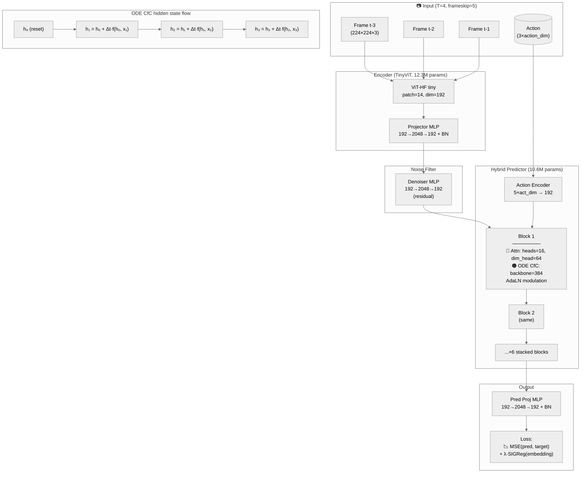
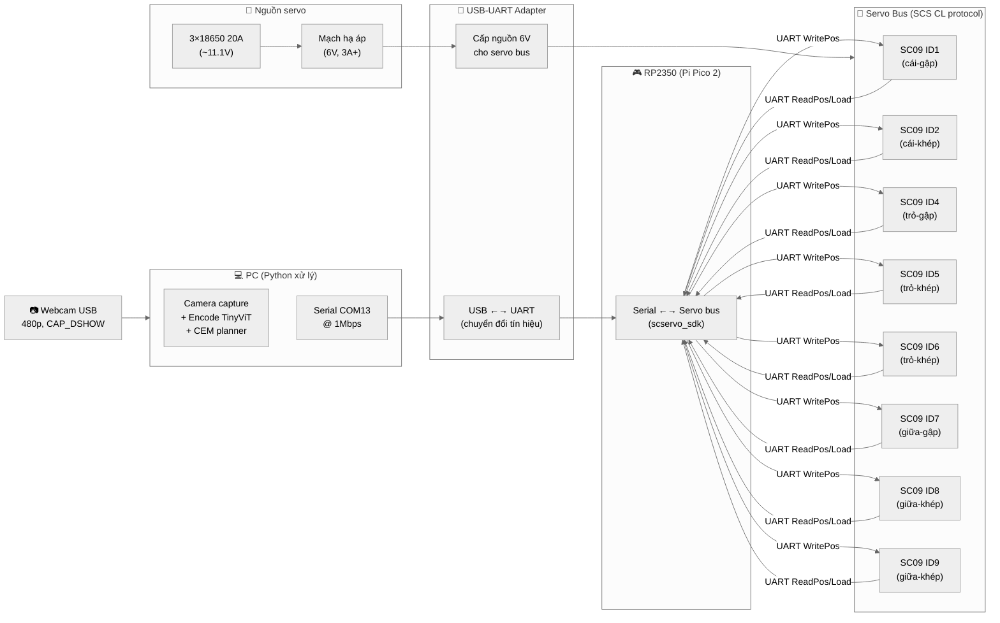

```mermaid
%%{init: {'theme': 'neutral', 'themeVariables': {'primaryColor': '#e8f0fe', 'secondaryColor': '#fce8e6', 'tertiaryColor': '#e6f4ea'}}}%%
graph TB
    subgraph Input["📷 Input (T=4, frameskip=5)"]
        F1["Frame t-3<br/>(224×224×3)"]
        F2["Frame t-2"]
        F3["Frame t-1"]
        A[("Action<br/>(3×action_dim)")]
    end
    
    subgraph Encoder["Encoder (TinyViT, 12.3M params)"]
        VIT["ViT-HF tiny<br/>patch=14, dim=192"]
        PROJ["Projector MLP<br/>192→2048→192 + BN"]
    end
    
    subgraph Denoiser["Noise Filter"]
        DN["Denoiser MLP<br/>192→2048→192<br/>(residual)"]
    end
    
    subgraph Predictor["Hybrid Predictor (10.6M params)"]
        ACT_ENC["Action Encoder<br/>5×act_dim → 192"]
        B1["Block 1<br/>────────<br/>🔵 Attn: heads=16, dim_head=64<br/>🟠 ODE CfC: backbone=384<br/>AdaLN modulation"]
        B2["Block 2<br/>(same)"]
        B3["...×6 stacked blocks"]
    end
    
    subgraph Output["Output"]
        PO["Pred Proj MLP<br/>192→2048→192 + BN"]
        LOSS["Loss:<br/>📉 MSE(pred, target)<br/>+ λ·SIGReg(embedding)"]
    end
    
    F1 & F2 & F3 --> VIT
    VIT --> PROJ
    PROJ --> DN
    DN --> B1
    A --> ACT_ENC
    ACT_ENC --> B1
    B1 --> B2 --> B3
    B3 --> PO
    PO --> LOSS
    subgraph CfCDetail["ODE CfC hidden state flow"]
        H1["h₀ (reset)"] --> H2["h₁ = h₀ + Δt·f(h₀, x₁)"]
        H2 --> H3["h₂ = h₁ + Δt·f(h₁, x₂)"]
        H3 --> H4["h₃ = h₂ + Δt·f(h₂, x₃)"]
    end
```

---

```mermaid
%%{init: {'theme': 'neutral', 'themeVariables': {'primaryColor': '#e8f0fe', 'secondaryColor': '#fce8e6'}}}%%
graph LR
    subgraph PC["💻 PC (Python xử lý)"]
        CAM_WORKER["Camera capture<br/>+ Encode TinyViT<br/>+ CEM planner"]
        SERIAL["Serial COM13<br/>@ 1Mbps"]
    end
    
    subgraph POWER["🔋 Nguồn servo"]
        BAT["3×18650 20A<br/>(~11.1V)"] --> HV["Mạch hạ áp<br/>(6V, 3A+)"]
    end
    
    subgraph ADAPT["🔌 USB-UART Adapter"]
        ADAPT_IN["USB ←→ UART<br/>(chuyển đổi tín hiệu)"]
        ADAPT_PWR["Cấp nguồn 6V<br/>cho servo bus"]
    end
    
    subgraph SERVO["🦾 Servo Bus (SCS CL protocol)"]
        S1["SC09 ID1<br/>(cái-gập)"]
        S2["SC09 ID2<br/>(cái-khép)"]
        S4["SC09 ID4<br/>(trỏ-gập)"]
        S5["SC09 ID5<br/>(trỏ-khép)"]
        S6["SC09 ID6<br/>(trỏ-khép)"]
        S7["SC09 ID7<br/>(giữa-gập)"]
        S8["SC09 ID8<br/>(giữa-khép)"]
        S9["SC09 ID9<br/>(giữa-khép)"]
    end
    
    subgraph CONTROL["🎮 RP2350 (Pi Pico 2)"]
        PICO["Serial ←→ Servo bus<br/>(scservo_sdk)"]
    end
    
    CAM["📷 Webcam USB<br/>480p, CAP_DSHOW"] --> PC
    PC --> SERIAL
    SERIAL --> ADAPT_IN
    ADAPT_IN --> PICO
    PICO -->|UART WritePos| S1 & S2 & S4 & S5 & S6 & S7 & S8 & S9
    S1 & S2 & S4 & S5 & S6 & S7 & S8 & S9 -->|UART ReadPos/Load| PICO
    HV --> ADAPT_PWR
    ADAPT_PWR --> SERVO
```
